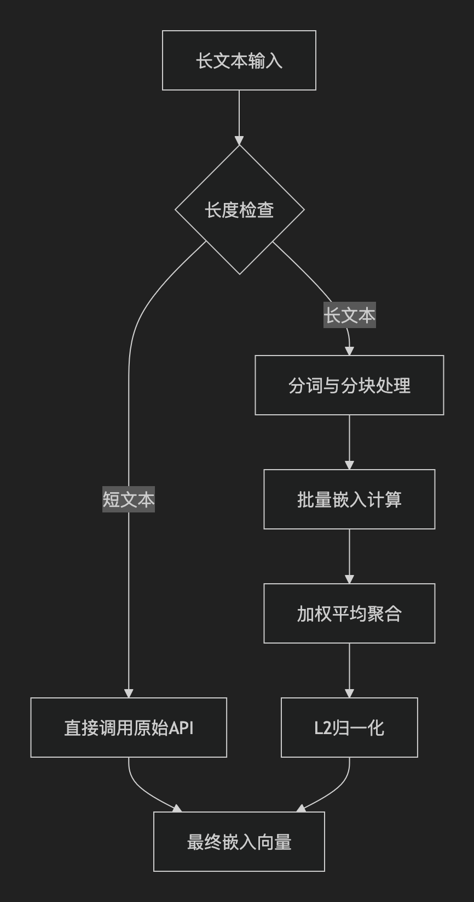

# 长上下文文本嵌入解决方案

## 前言

在搭建基于RAG的AI知识库时，文本嵌入的质量直接决定了知识检索的准确性。通常，嵌入模型（如`text-embedding-v4`）有8192 tokens的输入限制。

当处理报告、长篇文章等超出此限制的文本时，直接嵌入会触发错误。

本库深入探讨了此问题的成因，并提供了多种解决方案，例如借鉴了OpenAI的“长度安全嵌入”思路，通过智能分块与向量合并来优雅地解决这一难题

## 使用

- `extClassStruct.py` 中填写QWEN_GPT_API_KEY的值

- 执行`main.py` 文件

## 原理

### 🧠 核心设计思想

这个方案的灵感来源于OpenAI的`_get_len_safe_embeddings`方法，其核心思想是：当文本过长时，不是简单地截断丢弃，而是将其**智能地分割**成多个符合模型限制的块，分别获取嵌入后再**智能地合并**成一个能代表全文语义的向量。

这种“分而治之”的策略让我们在现有模型的能力范围内，优雅地突破了上下文长度的限制。

### ⚙️ 关键实现步骤解析

1. **分词与分块处理** 这是最关键的第一步。我使用了与`text-embedding-v4`模型匹配的`qwen-turbo`分词器，确保分块是基于**token数量**而非简单的字符长度。这是因为模型的实际限制是针对token的。代码会遍历文本，将其按预设的`embedding_ctx_length`（例如8100个tokens）切成小块。这里一个重要的实践经验是，虽然模型官方支持8192个tokens，但实际设置略低（如8100）更为稳定，这可能是因为API内部会添加一些特殊token。
2. **批量嵌入计算** 将所有分块后的文本片段组织成批次，调用DashScope原始的API接口（通过`super().embed_documents`）来高效地获取每个小块的嵌入向量。这样做的好处是充分利用了API的批量处理能力，减少了网络请求次数。
3. **加权平均聚合** 这是保持全文语义的关键。对于原始长文本分割出来的所有小块的嵌入向量，代码使用**加权平均**的方式进行合并。具体来说，对属于同一原始文本的所有分块嵌入向量求平均，从而得到一个综合性的向量表示。这种聚合方式有助于平滑噪声，使最终向量更能反映文档的整体信息。
4. **向量归一化** 在返回最终结果前，通常还会对聚合后的向量进行L2归一化。这一步是很多嵌入模型的标配操作，它可以确保所有向量的模长为1，这在计算余弦相似度时至关重要，因为余弦相似度就是计算归一化向量后的点积。

### 💡 方案的优势与注意事项

- ∙**优势**：此方案最大的优点是**非侵入性**。你无需改变现有的DashScope API调用方式，这个扩展类会自动处理长度问题。同时，它尽可能保留了长文档的整体语义，比简单截断的效果要好得多。
- ∙**注意**：这种方案适用于需要为**整个长文档**生成一个**整体向量**的场景（例如文档级别的检索或分类）。如果你的应用场景更注重段落或章节级别的精确检索（即需要找到文档中最相关的部分），那么更优的做法是直接将分块后的向量存入向量数据库，进行**分块级别的检索**，而不是合并成一个向量。

